# 蓝牙门锁

[中文版](README_zh.md) | [English](README.md)

## 使用说明

|类名|说明|
|--|--|
|`ThingOptimusSdk`|初始化 SDK 入口，用来获取门锁管理类|
|`IThingLockManager`|门锁管理类，可以获取不同类型的门锁类|
|`IThingBleLockV2`|蓝牙门锁类，所有蓝牙门锁相关方法都在其中|

**示例代码**

通过设备ID创建蓝牙门锁类。

```java
// 初始化 SDK，仅需要调用一次
ThingOptimusSdk.init(getApplicationContext());
// 获取 IThingLockManager
IThingLockManager thingLockManager = ThingOptimusSdk.getManager(IThingLockManager.class);
// 创建 IThingBleLockV2
IThingBleLockV2 thingLockDevice = thingLockManager.getBleLockV2(your_device_id);
```

## 名称解释

|名词列表|说明|
|---|---|
|门锁劫持/特殊|指将特定的指纹、密码等，设置为劫持密码，当用户被劫持，并使用该密码开锁时，门会打开。同时，门锁将开门报警信息发送至家人手机或物业管理系统。|
|门锁成员|门锁成员为 **家庭成员**： <ul><li>家庭成员：涂鸦智能生活 App SDK 中的家庭成员概念。门锁 SDK 将对应的门锁密码编号与该账号关联起来。参考[家庭管理](https://developer.tuya.com/cn/docs/app-development/homemanage?id=Ka6kjkgere4ae)。</li></ul>|
|lockUserId|创建门锁成员时，云端为设备分配的固件成员 ID，代表着固件内记录的用户 ID。|
|userId|创建门锁成员时，云端分配的数据库记录 ID，代表着用户的唯一 ID。|
|dpCode|设备功能的标识符。每个设备功能都有名称和编号，请参考下文 [门锁功能列表](https://developer.tuya.com/cn/docs/app-development/bluetoothlock?id=Ka6o1i4rkvfhc#FunctionListforBluetoothDoorlock)。|
|unlockId|解锁方式编号，由解锁方式dpId+硬件锁id组合而成，示例：12-02|

<font color=#ff0000>特别提醒:</font> 接入本SDK后、需要执行 [同步数据](#同步门锁随机数配件记录)，相关解锁方式方可使用。


## 一、门锁成员

本小节主要介绍门锁成员中 家庭成员 的管理操作。

### 获取门锁成员列表

**接口说明**

``` java
/**
* 获取家庭成员列表
*
* @param callback 回调
*/
void getProLockMemberList(IThingResultCallback<ArrayList<MemberInfoBean>> callback);
```
<b>`MemberInfoBean`</b> 数据模型
|字段|类型|描述|
|---|---|---|
|userId|String|用户 ID|
|avatarUrl|String|头像 URL|
|lockUserId|Integer|门锁中的用户 ID|
|nickName|String|昵称|
|userType|Integer|用户类型<ul><li>10: 管理员</li><li>20: 普通成员</li><li>50: 家庭拥有者</li></ul>|
|backHomeNotifyAttr|Integer|`家人到家提醒`开关是否打开<ul><li>0: 否</li><li>1: 是</li></ul>|
|userContact|String|用户联系方式|
|offlineUnlock|Boolean|是否支持离线解锁<ul><li>是: true</li><li>否: false</li></ul>|
|unlockDetail|List|用户拥有的解锁方式列表，查看 `UnlockDetail` 数据模型|
|timeScheduleInfo|TimeScheduleInfo|用户时效|

<b>`TimeScheduleInfo`</b> 数据模型
|字段|类型|描述|
|---|---|---|
|permanent|Boolean|是否永久用户|
|timeSetShifted|Boolean|管理员的时效是否偏移(非永久)|
|userTimeSet|String|用户时效(16进制)|
|effectiveTime|Integer|生效时间(10位)|
|expiredTime|Integer|失效时间(10位)|
|scheduleDetails|List|是否周循环及生效区间，查看 `ScheduleBean` 数据模型|

<b>`ScheduleBean`</b> 数据模型
|字段|类型|描述|
|---|---|---|
|workingDay|Integer|工作日(参考值见修改成员时效 `特殊说明`)|
|allDay|Boolean|是否全天|
|effectiveTime|Integer|生效分钟<br>例: 当前早上8点整，值为 8 * 60 = 480|
|invalidTime|Integer|失效分钟<br>例: 当前下上8点整，值为 20 * 60 = 1200|
|timeZoneId|String|时区信息|

<b>`UnlockDetail`</b> 数据模型
|字段|类型|描述|
|---|---|---|
|dpId|Integer|dp点|
|count|Integer|个数|
|unlockList|List|解锁方式详情列表，查看 `UnlockInfoBean` 数据模型|

<b>`UnlockInfoBean`</b> 数据模型
|字段|类型|描述|
|---|---|---|
|unlockId|String|解锁方式编号|
|opModeId|Long|解锁方式云端序号|
|unlockName|String|解锁方式名称|
|unlockAttr|Integer|解锁方式属性<ul><li>1: 特殊/劫持</li><li>0: 非特殊/非劫持</li></ul>|
|adminFlag|Boolean|是否是管理员指纹|
|photoUnlock|Boolean|是否开启开门抓拍(仅拍照锁有此字段)|

**示例代码**

``` java
thingLockDevice.getProLockMemberList(new IThingResultCallback<ArrayList<MemberInfoBean>>() {
    @Override
    public void onSuccess(ArrayList<MemberInfoBean> result) {
        Log.i(Constant.TAG, "getProLockMemberList success: lockUserBean = " + result);
    }

    @Override
    public void onError(String code, String message) {
        Log.e(Constant.TAG, "getProLockMemberList failed: code = " + code + "  message = " + message);
    }
});
```


### 创建单个门锁成员

该接口创建的是家庭成员，添加的用户需要真实的App账号。

**接口说明**
``` java
/**
* 添加家庭成员
*
* @param memberWrapperBean 入参
* @param callback          回调
*/
void createProLockMember(MemberWrapperBean memberWrapperBean,IThingDataCallback<MemberBean> callback);
```

<b>`MemberWrapperBean`</b> 数据模型参考：[家庭成员信息](https://developer.tuya.com/cn/docs/app-development/member-information-management?id=Kaiy91tma26nh)


**示例代码**

``` java
MemberWrapperBean.Builder memberWrapperBean = new MemberWrapperBean.Builder();
memberWrapperBean.setNickName();//成员昵称
memberWrapperBean.setCountryCode();//国区号
memberWrapperBean.setAccount();//App账号
memberWrapperBean.setRole();//成员角色（请在家庭成员查看 MemberRole 定义类型）
memberWrapperBean.setHomeId();//当前设备所属家庭 ID
memberWrapperBean.setAutoAccept(false);//true为受邀请账号自动接受家庭加入邀请
thingLockDevice.createProLockMember(memberWrapperBean.build(), new IThingDataCallback<MemberBean>() {
    @Override
    public void onSuccess(MemberBean result) {
        Log.i(Constant.TAG, "add lock user success");
    }

    @Override
    public void onError(String code, String message) {
        Log.e(Constant.TAG, "add lock user failed: code = " + code + "  message = " + message);
    }
});
```


### 删除单个门锁成员

删除家庭用户成员、并删除设备上成员对应的所有解锁方式。

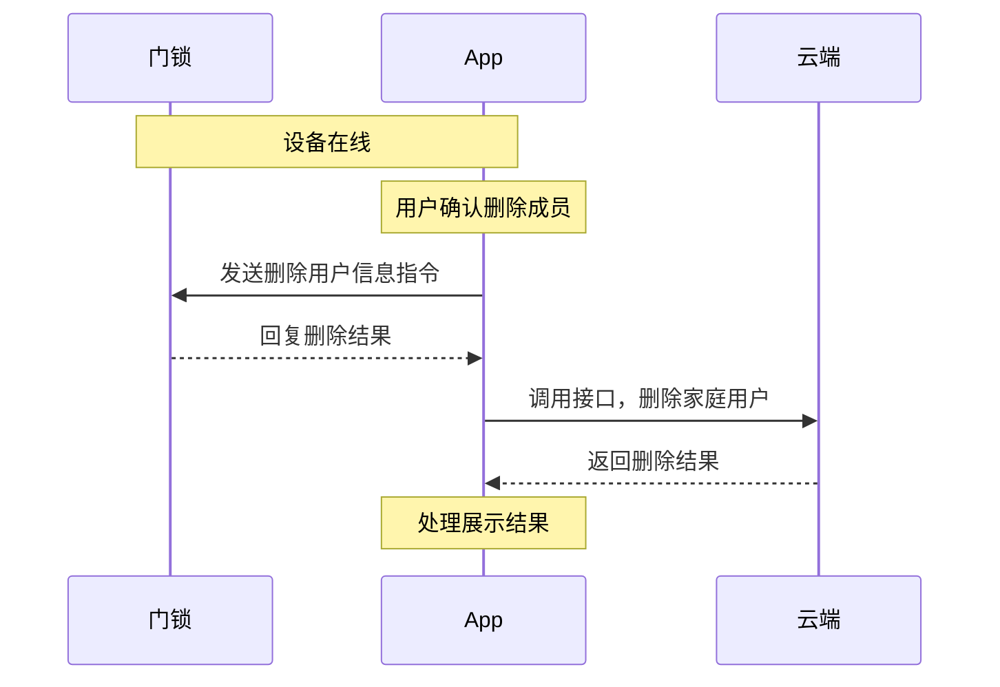

**接口说明**

``` java
/**
* 删除成员
*
* @param memberInfoBean 成员信息
* @param callback       回调
*/
void removeProLockMember(MemberInfoBean memberInfoBean, IResultCallback callback);
```

**示例代码**

其中入参 `memberInfoBean` 为成员列表接口 `getProLockMemberList` 返回的数据模型

``` java
thingLockDevice.removeProLockMember(memberInfoBean, new IResultCallback() {
    @Override
    public void onError(String code, String error) {
        Log.e(Constant.TAG, "removeProLockMember failed: code = " + code + "  message = " + error);
    }

    @Override
    public void onSuccess() {
        Log.i(Constant.TAG, "removeProLockMember success");
    }
});
```

### 修改单个成员信息

该接口只能修改成员昵称及成员角色

**接口说明**

``` java
/**
* 成员信息编辑
*
* @param memberWrapperBean 入参
* @param callback          回调
*/
void updateProLockMemberInfo(MemberWrapperBean memberWrapperBean, IResultCallback callback);
```

<b>`MemberWrapperBean`</b> 数据模型参考：[家庭成员信息](https://developer.tuya.com/cn/docs/app-development/member-information-management?id=Kaiy91tma26nh)

**示例代码**

``` java
MemberWrapperBean.Builder memberWrapperBean = new MemberWrapperBean.Builder();
memberWrapperBean.setNickName();//成员昵称
memberWrapperBean.setRole();//成员角色（请在家庭成员查看 MemberRole 定义类型）
memberWrapperBean.setMemberId();//成员列表返回的 userId
thingLockDevice.updateProLockMemberInfo(memberWrapperBean.build(), new IResultCallback() {
    @Override
    public void onError(String code, String error) {
        Log.e(Constant.TAG, "updateProLockMemberInfo failed: code = " + code + "  message = " + error);
    }

    @Override
    public void onSuccess() {
        Log.i(Constant.TAG, "updateProLockMemberInfo success");
    }
});
```

### 修改单个成员时效（老版本不支持）

修改单个成员时效会和硬件进行交互，请保持门锁设备的蓝牙连接。

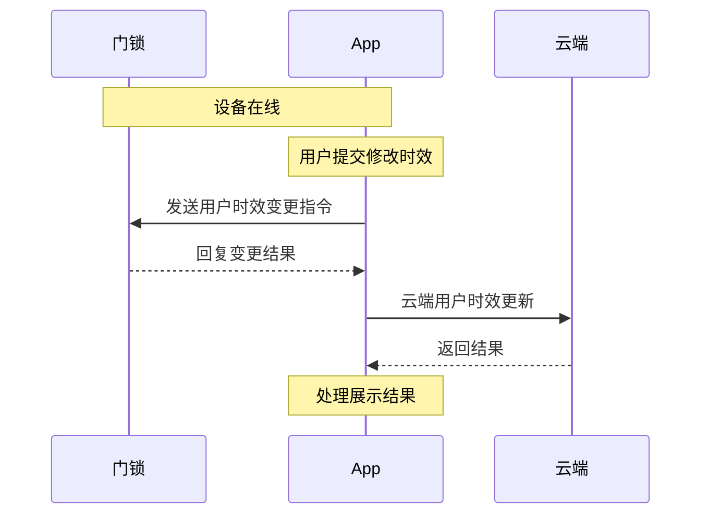

**接口说明**

其中入参 `memberInfoBean` 为成员列表接口 `getProLockMemberList` 返回的数据模型

``` java
/**
* 修改单个成员时效
*
* @param memberInfoBean 成员信息
* @param callback       回调
*/
void updateProLockMemberTime(MemberInfoBean memberInfoBean, IThingResultCallback<Boolean> callback);
```

**示例代码**

``` java
thingLockDevice.updateProLockMemberTime(memberInfoBean, new IThingResultCallback<Boolean>() {
    @Override
    public void onSuccess(Boolean result) {
        Log.i(Constant.TAG, "updateProLockMemberTime success");
    }

    @Override
    public void onError(String code, String message) {
        Log.e(Constant.TAG, "updateProLockMemberTime failed: code = " + code + "  message = " + message);
    }
});
```

**特殊说明**

周循环的选择字段 `workingDay` 由七个1或0组成、其中1为开启、0为关闭，排序示例如下。由二进制转换为十进制存储。
|六|五|四|三|二|一|日|二进制表示|计算结果（十进制）|
|---|---|---|---|---|---|---|---|---|
|1|1|1|1|1|1|1|1111111|127|
|0|0|0|0|0|0|0|0000000|0|
|0|1|1|1|1|0|0|0111100|60|

SDK提供了一个简便的计算方法，其中 `ScheduleBean` 见上面数据模型
```
//选中添加
scheduleBean.dayOfWeeks.add(ScheduleBean.DayOfWeek.MONDAY);
//移除
scheduleBean.dayOfWeeks.remove(ScheduleBean.DayOfWeek.FRIDAY);
//解析展示数据
scheduleBean.dayOfWeeks = LockUtil.parseWorkingDay(scheduleBean.workingDay);
//封装已选择的列表
scheduleBean.workingDay = Integer.parseInt(LockUtil.convertWorkingDay(scheduleBean.dayOfWeeks);
```

### 获取当前用户信息

**接口说明**

``` java
/**
* 获取当前用户信息
*
* @param callback 回调
*/
void getCurrentMemberDetail(IThingResultCallback<BLELockUser> callback);
/**
 * 获取当前用户信息 pro版本
 *
 * @param callback 回调
 */
void getProCurrentMemberDetail(IThingResultCallback<BLELockUserV3> callback);
```

**示例代码**

``` java
thingLockDevice.getCurrentMemberDetail(new IThingResultCallback<BLELockUser>() {
    @Override
    public void onSuccess(BLELockUser result) {
        Log.i(Constant.TAG, "getCurrentMemberDetail:" + result);
    }

    @Override
    public void onError(String code, String error) {
        Log.e(Constant.TAG, "getCurrentMemberDetail onError code:" + code + ", error:" + error);
    }
});
//PRO版本
thingLockDevice.getProCurrentMemberDetail(new IThingResultCallback<BLELockUserV3>() {
    @Override
    public void onSuccess(BLELockUserV3 result) {
        Log.i(Constant.TAG, "getProCurrentMemberDetail:" + result);
    }

    @Override
    public void onError(String code, String error) {
        Log.e(Constant.TAG, "getCurrentMemberDetail onError code:" + code + ", error:" + error);
    }
});
```


## 二、蓝牙连接

蓝牙门锁需要 App 开启蓝牙后，部分功能才能正常使用。

### 查询蓝牙连接状态

SDK 在正常情况下会自动连接，通常使用以下方法进行门锁连接状态判断。

**接口说明**

``` java
/**
* @return 查询蓝牙连接状态
*/
boolean isBLEConnected();
/**
* @return 是否在线
*/
boolean isOnline();
```

**示例代码**

``` java
boolean isBLEConnected = thingLockDevice.isBLEConnected();
boolean isOnline = thingLockDevice.isOnline();
if (!isBLEConnected && isOnline) {
    device_state_view.setText("网关已连接");
} else if (isBLEConnected && isOnline) {
    device_state_view.setText("蓝牙已连接");
} else {
    device_state_view.setText("离线");
}
```

### 门锁蓝牙连接

如果查询结果显示门锁未连接蓝牙，调用此接口可以连接到门锁。

**接口说明**

执行连接有30秒的超时时间，超时会通过onError回调，该ConnectV2Listener只回调一次，该方法为 [connectBleDevice](https://developer.tuya.com/cn/docs/app-development/android-bluetooth-ble?id=Karv7r2ju4c21#title-15-%E8%BF%9E%E6%8E%A5%E7%A6%BB%E7%BA%BF%E8%AE%BE%E5%A4%87) 的二次封装

``` java
/**
* 触发蓝牙连接
*
* @param connectListener 回调
*/
void autoConnect(ConnectV2Listener connectListener);
```

**示例代码**
``` java
thingLockDevice.autoConnect(new ConnectV2Listener() {
    @Override
    public void onStatusChanged(boolean online) {
        Log.e(Constant.TAG, "device online:" + online);
    }

    @Override
    public void onError(String code, String error) {
        Log.e(Constant.TAG, "autoConnect onError code:" + code + ", error:" + error);
    }
});
```

## 三、蓝牙解锁和落锁

### 蓝牙近程解锁

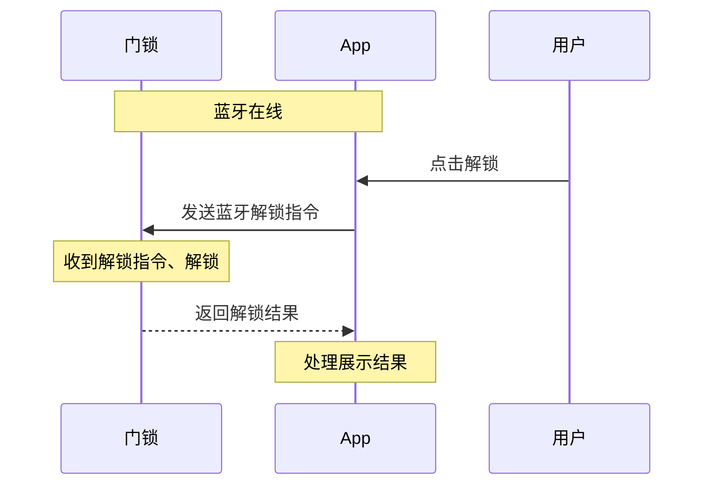

**接口说明**

解锁有30秒的超时时间，超时会通过onError回调，该IResultCallback只回调一次

``` java
/**
* 蓝牙开锁
*
* @param lockUserId 当前用户锁ID
* @param callback   回调
*/
void bleUnlock(String lockUserId, IResultCallback callback);
```

**示例代码**

``` java
//获取当前用户锁ID
thingLockDevice.getCurrentMemberDetail(new IThingResultCallback<BLELockUser>() {
    @Override
    public void onSuccess(BLELockUser result) {
        Log.i(Constant.TAG, "getCurrentMemberDetail:" +result);
        //执行解锁
        thingLockDevice.bleUnlock(result.lockUserId, new IResultCallback() {
            @Override
            public void onError(String code, String error) {
                Log.e(Constant.TAG, "bleUnlock onError code:" + code + ", error:" + error);
            }

            @Override
            public void onSuccess() {
                Log.i(Constant.TAG, "bleUnlock onSuccess");
            }
        });
    }

    @Override
    public void onError(String code, String error) {
        Log.e(Constant.TAG, "getCurrentMemberDetail onError code:" + code + ", error:" + error);
    }
});
```

### 蓝牙近程落锁

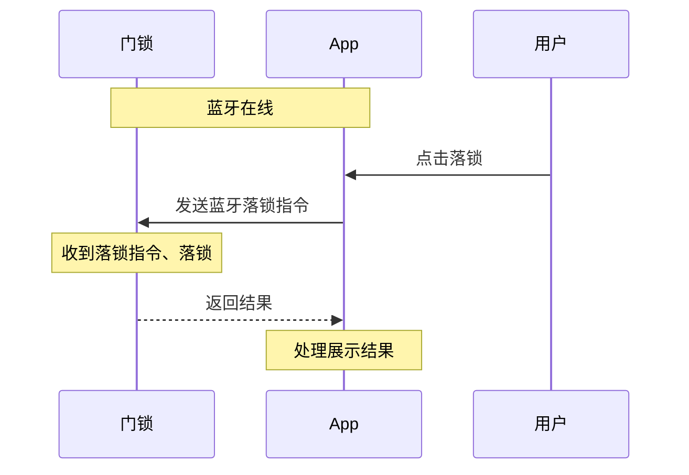

**接口说明**

蓝牙门锁与 App 连接后，可调用此接口落锁。
落锁有30秒的超时时间，超时会通过onError回调，该IResultCallback只回调一次

``` java
/**
* 蓝牙关锁
*
* @param callback 回调
*/
void bleManualLock(IResultCallback callback);
```

**示例代码**

``` java
thingLockDevice.bleManualLock(new IResultCallback() {
    @Override
    public void onError(String code, String error) {
        Log.e(Constant.TAG, "bleManualLock onError code:" + code + ", error:" + error);
    }

    @Override
    public void onSuccess() {
        Log.i(Constant.TAG, "bleManualLock onSuccess");
    }
});
```

### 蓝牙远程开关锁

查询和开关设置请查看 [设置](#七设置) 相关文档

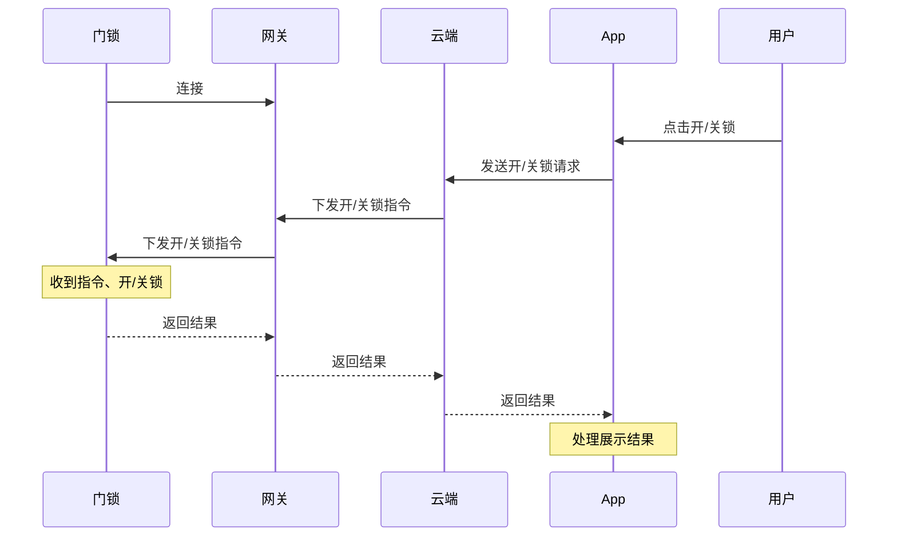

**接口说明**

有30秒的超时时间，超时会通过onError回调，该IResultCallback只回调一次
``` java
/**
* 远程开关锁
*
* @param open     开/关
* @param callback 回调
*/
void remoteSwitchLock(boolean open, IResultCallback callback);
```

**示例代码**

``` java
thingLockDevice.remoteSwitchLock(true/false, new IResultCallback() {
    @Override
    public void onError(String code, String error) {
        Log.e(Constant.TAG, "remoteSwitchLock onError code:" + code + ", error:" + error);
    }

    @Override
    public void onSuccess() {
        Log.i(Constant.TAG, "remoteSwitchLock onSuccess");
    }
});
```

## 四、门锁记录


### 获取门锁告警记录

该方法为老公版方法，PRO类型门锁建议使用 [带筛选的新版记录接口（日志组件）](#带筛选的新版记录接口日志组件)

**接口说明**

``` java
/**
* get alarm records in old version
*
* @param offset   page number
* @param limit    item count
* @param callback callback
*/
void getAlarmRecordList(int offset, int limit, IThingResultCallback<Record> callback);
```

<b>参数说明</b>

|参数|说明|
|---|---|
|offset|返回的记录页码数|
|limit|返回的记录条目数|

<b>`Record`</b> 数据模型

|字段|类型|描述|
|---|---|---|
|totalCount|Integer|总条目|
|hasNext|Boolean|是否有下一页|
|datas|List|记录数据内容，参考`DataBean`|

<b>`DataBean`</b> 数据模型

|字段|类型|描述|
|---|---|---|
|userId|String|成员 ID|
|userName|String|用户昵称|
|unlockType|String|解锁类型|
|devId|String|设备 ID|
|createTime|Long|该记录的时间戳|
|tags|Integer|标位<ul><li>0：表示其他</li><li>1：表示劫持报警</li></ul>|
|unlockRelation|UnlockRelation|解锁类型和解锁密码编号的关系实例，如不是开锁记录，可为空|


**示例代码**

``` java
thingLockDevice.getAlarmRecordList(0, 10, new IThingResultCallback<Record>() {
    @Override
    public void onSuccess(Record result) {
        Log.i(Constant.TAG, "get alarm records success: recordBean = " + result);
    }

    @Override
    public void onError(String errorCode, String errorMessage) {
        Log.e(Constant.TAG, "get alarm records failed: code = " + errorCode + "  message = " + errorMessage);
    }
});
```

### 获取门锁开锁记录

该方法为老公版方法，PRO类型门锁建议使用 [带筛选的新版记录接口（日志组件）](#带筛选的新版记录接口日志组件)

**接口说明**

相关参数参考告警记录

``` java
/**
* get unlock records in old version
*
* @param offset   page number
* @param limit    item count
* @param callback callback
*/
void getUnlockRecordList(int offset, int limit, IThingResultCallback<Record> callback);
```

**示例代码**

``` java
thingLockDevice.getUnlockRecordList(0, 10, new IThingResultCallback<Record>() {
    @Override
    public void onSuccess(Record result) {
        Log.i(Constant.TAG, "getUnlockRecordList success: recordBean = " + result);
    }

    @Override
    public void onError(String errorCode, String errorMessage) {
        Log.e(Constant.TAG, "getUnlockRecordList failed: code = " + errorCode + "  message = " + errorMessage);
    }
});
```

### 获取门锁告警记录

该方法为老公版方法，PRO类型门锁建议使用 [带筛选的新版记录接口（日志组件）](#带筛选的新版记录接口日志组件)

**接口说明**

相关参数参考告警记录

``` java
/**
* get hijacking records in old version
*
* @param offset page number
* @param limit item count
* @param callback callback
*/
void getHijackRecords(int offset, int limit, IThingResultCallback<Record> callback);
```

**示例代码**

``` java
thingLockDevice.getHijackRecords(0, 10, new IThingResultCallback<Record>() {
    @Override
    public void onSuccess(Record result) {
        Log.i(Constant.TAG, "getHijackRecords success: recordBean = " + result);
    }

    @Override
    public void onError(String errorCode, String errorMessage) {
        Log.e(Constant.TAG, "getHijackRecords failed: code = " + errorCode + "  message = " + errorMessage);
    }
});
```

### 带筛选的新版记录接口（日志组件）

新版本记录接口，适用于PRO类型的门锁

**接口说明**

``` java
/**
* PRO 记录列表
*
* @param request  入参
* @param callback 监听
*/
void getProUnlockRecordList(RecordRequest request, IThingResultCallback<ProRecord> callback);
```

<b>`RecordRequest`</b> 数据模型

|字段|类型|描述|
|---|---|---|
|logCategories|String|日志类型<ul><li>操作日志: operation</li><li>开门记录: unlock_record</li><li>关门记录: close_record</li><li>告警记录: alarm_record</li></ul>以逗号分隔，SDK封装为枚举List|
|userIds|String|需要筛选的用户id的列表，以逗号分隔。 如 `12,13`|
|onlyShowMediaRecord|Boolean|是否仅显示带图片或者视频的记录， 默认为 `false` 显示所有记录|
|startTime|Long|开始时间（单位毫秒）|
|endTime|Long|结束时间（单位毫秒）|
|lastRowKey|String|上一页的数据key（第一页为空）|
|limit|Integer|每页数据个数|

<b>`ProRecord`</b> 数据模型

|字段|类型|描述|
|---|---|---|
|hasNext|Boolean|是否有分页|
|lastRowKey|String|上一页的数据key|
|records|List|记录列表，单个记录参考 `DataBean`|

<b>`DataBean`</b> 数据模型

|字段|类型|是否必反回|描述|
|---|---|---|---|
|logId|Long|是|日志编号|
|logCategory|String|是|日志类型<ul><li>操作日志: operation</li><li>开门记录: unlock_record</li><li>关门记录: close_record</li><li>告警记录: alarm_record</li></ul>|
|logType|String|是|日志类型， 见附录|
|recordType|Integer|否|仅开门记录返回<ol><li>普通开门记录 </li><li>告警记录</li></ol>|
|unlockNameRosettaKey|String|否|关锁记录的类型，见附录|
|currentUser|Boolean|否|是否是当前用户的记录， 是为`true`，非组合解锁必反回|
|userId|String|否|用户编号(仅开门记录，劫持告警，操作记录返回)|
|userName|String|否|用户名称|
|memberBindableFlag|Boolean|是|是否可以绑定到用户|
|unlockName|String|否|解锁方式名称， 可能为空|
|time|Long|是|日志事件时间|
|relateDevName|String|否|关联设备名称|
|relateOpMode|String|否|关联解锁信息|
|data|String|是|操作记录，数据格式定义见附录|
|unionUnlockInfo|UnionUnlockInfo|否|组合解锁信息|
|mediaInfoList|List|否|视频和图片信息(仅可视对讲，wifi低功耗/常保活带视频或者图像的锁有此字段)，参考`MediaInfoBean`|

<b>`UnionUnlockInfo`</b> 数据模型

|字段|类型|是否必反回|描述|
|---|---|---|---|
|userName|String|否|组合解锁时，触发的用户名称(可能为空)|
|opMode|String|否|组合解锁时，解锁方式类型|
|unlockName|String|否|组合解锁时，解锁方式名称(可能为空)|
|currentUser|Boolean|否|组合解锁时，是否是当前用户|
|sn|Integer|否|组合解锁时，硬件编号|

<b>`MediaInfoBean`</b> 数据模型

|字段|类型|是否必反回|描述|
|---|---|---|---|
|fileUrl|String|否|封面图文件url|
|fileKey|String|否|封面图的解密密钥|
|mediaPath|String|否|记录视频的相对地址|
|mediaBucket|String|否|记录视频所属的仓库地址|
|mediaKey|String|否|记录视频的解密密钥|


**示例代码**

``` java
ArrayList<RecordRequest.LogRecord> logRecords = new ArrayList<>();
logRecords.add(RecordRequest.LogRecord.UNLOCK_RECORD);
logRecords.add(RecordRequest.LogRecord.CLOSE_RECORD);
logRecords.add(RecordRequest.LogRecord.ALARM_RECORD);
logRecords.add(RecordRequest.LogRecord.OPERATION);
RecordRequest request = new RecordRequest();
request.setLogCategories(logRecords);
request.setLimit(10);
thingLockDevice.getProUnlockRecordList(request, new IThingResultCallback<ProRecord>() {
    @Override
    public void onSuccess(ProRecord result) {
        Log.i(Constant.TAG, "get ProUnlock RecordList success: recordBean = " + result);
    }

    @Override
    public void onError(String errorCode, String errorMessage) {
        Log.e(Constant.TAG, "get ProUnlock RecordList failed: code = " + errorCode + "  message = " + errorMessage);
    }
});
```

## 五、解锁方式管理

### 获取成员已绑定的解锁方式列表

**接口说明**

``` java
/**
* 获取成员已绑定的解锁方式列表
*
* @param userId   用户id
* @param callback 回调
*/
void getProBoundUnlockOpModeList(String userId, IThingResultCallback<MemberInfoBean> callback);
```

**示例代码**

返回成员数据模型 `MemberInfoBean` 参考成员列表

``` java
thingLockDevice.getProBoundUnlockOpModeList(userId, new IThingResultCallback<MemberInfoBean>() {
    @Override
    public void onSuccess(MemberInfoBean result) {
        Log.i(Constant.TAG, "getProBoundUnlockOpModeList:" + result);
    }

    @Override
    public void onError(String code, String message) {
        Log.e(Constant.TAG, "getProBoundUnlockOpModeList failed: code = " + code + "  message = " + message);
    }
});
```

### 判断是否有需要分配的开锁方式

**接口说明**

``` java
/**
* 判断是否有需要分配的开锁方式
*
* @param callback 回调
*/
void isProNeedAllocUnlockOpMode(IThingResultCallback<Boolean> callback);
```

**示例代码**

``` java
thingLockDevice.isProNeedAllocUnlockOpMode(new IThingResultCallback<Boolean>() {
    @Override
    public void onSuccess(Boolean result) {
        Log.i(Constant.TAG, "isProNeedAllocUnlockOpMode:" + result);
    }

    @Override
    public void onError(String code, String message) {
        Log.e(Constant.TAG, "isProNeedAllocUnlockOpMode failed: code = " + code + "  message = " + message);
    }
});
```

### 获取成员未绑定的解锁方式列表

**接口说明**

``` java
/**
* 获取成员未绑定的解锁方式列表
*
* @param callback 回调
*/
void getProUnboundUnlockOpModeList(IThingResultCallback<ArrayList<AllocOpModeBean>> callback);
```

**示例代码**

``` java
thingLockDevice.getProUnboundUnlockOpModeList(new IThingResultCallback<ArrayList<AllocOpModeBean>>() {
    @Override
    public void onSuccess(ArrayList<AllocOpModeBean> result) {
        Log.i(Constant.TAG, "getProUnboundUnlockOpModeList:" + result);
    }

    @Override
    public void onError(String code, String message) {
        Log.e(Constant.TAG, "getProUnboundUnlockOpModeList failed: code = " + code + "  message = " + message);
    }
});
```

<b>`AllocOpModeBean`</b> 数据模型

|字段|类型|描述|
|---|---|---|
|opMode|String|解锁方式<ul><li>1: 指纹</li><li>2: 密码</li><li>3: 门卡</li></ul>|
|unlockList|List|待分配的解锁方式详情，参考数据模型 `UnlockInfoBean`|

### 开锁方式分配到人

**接口说明**

``` java
/**
* 开锁方式分配到人
*
* @param userId    用户id
* @param unlockIds 解锁方式dp
* @param callback  回调
*/
void allocProUnlockOpMode(String userId, List<String> unlockIds, IThingResultCallback<Boolean> callback);
```

入参说明

|字段|类型|描述|
|---|---|---|
|userId|String|用户ID|
|unlockIds|List|解锁方式列表|

**示例代码**

``` java
thingLockDevice.allocProUnlockOpMode(userId, unlockIds, new IThingResultCallback<Boolean>() {
    @Override
    public void onSuccess(Boolean result) {
        Log.i(Constant.TAG, "allocProUnlockOpMode onSuccess: " + result);
    }

    @Override
    public void onError(String code, String message) {
        Log.e(Constant.TAG, "allocProUnlockOpMode failed: code = " + code + "  message = " + message);
    }
});
```

### App发起添加解锁方式

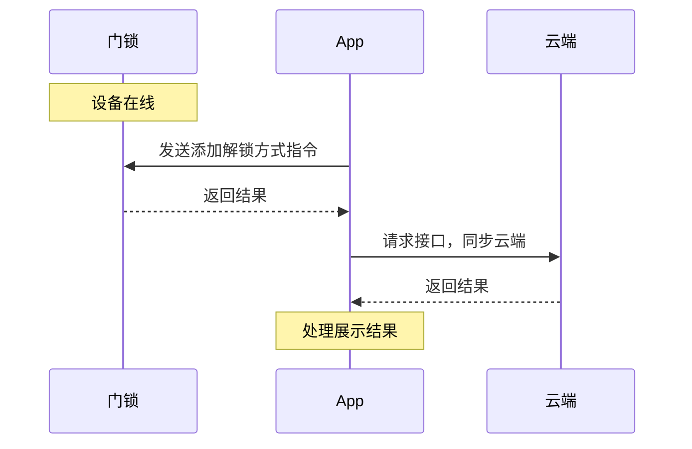

**接口说明**

``` java
/**
* 老公版-添加解锁方式
*
* @param opModeAddRequest 入参
* @param callback         回调
*/
void addUnlockOpModeForMember(OpModeRequest opModeAddRequest, IThingResultCallback<AddOpmodeResult> callback);
/**
* PRO版本-添加解锁方式
*
* @param opModeAddRequest 入参
* @param callback         回调
*/
void addProUnlockOpModeForMember(OpModeRequest opModeAddRequest, IThingResultCallback<AddOpmodeResult> callback);
```

<b>`OpModeRequest`</b> 数据模型

|字段|类型|描述|
|---|---|---|
|userId|String|用户ID|
|unlockId|String|解锁方式编号（dp + 硬件锁id），例: 1-01|
|unlockName|String|解锁方式名称（可以为空，老版本必填）|
|opModeId|Long|解锁方式云端序号（更新时使用）|
|unlockAttr|Integer|是否开启特殊解锁通知（劫持）<ul><li>0: 否</li><li>1: 是</li></ul>|
|password|String|密码类型密码value|
|notifyInfo|NotifyInfoBean|通知信息（PRO专用）|
|times|Integer|次数 `0-255`|
|lockUserId|Integer| 用户在门锁上的编号|
|unlockType|String|解锁方式类型 `dpCode` |
|userType|Integer|用户类型<ul><li>10: 管理员</li><li>20: 普通成员</li><li>50: 家庭拥有者</li></ul>|

<b>`NotifyInfoBean`</b> 数据模型

|字段|类型|描述|
|---|---|---|
|appSend|Boolean|是否发送app消息（PRO专用）|

**示例代码**
老版本与PRO版本的区别是新版本增加一些功能支持，接口版本不一致。
``` java
OpModeRequest request = new OpModeRequest()
request.setUserType();//用户类型
request.setUserId();//用户ID
request.setLockUserId();//用户的锁编号
request.setUnlockName();//解锁方式名称
request.setUnlockAttr(0);//是否特殊（老公版叫劫持）
request.setPassword();//密码类型解锁方式需要输入
//老版本示例
thingLockDevice.addUnlockOpModeForMember(request, new IThingResultCallback<AddOpmodeResult>() {
    @Override
    public void onSuccess(AddOpmodeResult result) {
        Log.i(Constant.TAG, "addUnlockOpModeForMember onSuccess");
    }

    @Override
    public void onError(String code, String message) {
        Log.e(Constant.TAG, "addUnlockOpModeForMember onError:" + code + ", message: " + message);
    }
});
//PRO版本示例
thingLockDevice.addProUnlockOpModeForMember(request, new IThingResultCallback<AddOpmodeResult>() {
    @Override
    public void onSuccess(AddOpmodeResult result) {
        Log.i(Constant.TAG, "addProUnlockOpModeForMember onSuccess");
    }

    @Override
    public void onError(String code, String message) {
        Log.e(Constant.TAG, "addProUnlockOpModeForMember onError:" + code + ", message: " + message);
    }
});
```

<b>`AddOpmodeResult`</b> 数据模型

|字段|类型|描述|
|---|---|---|
|opModeId|Long|解锁方式云端序号（更新时使用）|
|unlockName|String|解锁方式名称（可以为空）|

### App发起删除解锁方式


**接口说明**

``` java
/**
* 老版本 删除解锁方式
*
* @param unlockMode 入参
* @param callback   回调
*/
void removeUnlockOpModeForMember(OpModeRemoveRequest unlockMode, IThingResultCallback<Boolean> callback);
/**
* PRO 删除解锁方式
*
* @param unlockMode 入参
* @param callback   回调
*/
void removeProUnlockOpModeForMember(OpModeRemoveRequest unlockMode, IThingResultCallback<Boolean> callback);
```

<b>`OpModeRemoveRequest`</b> 数据模型

|字段|类型|描述|
|---|---|---|
|userId|String|用户ID|
|lockUserId|String|用户锁ID|
|userType|Integer|用户类型|
|unlockId|String|解锁方式编号|
|opModeId|String|解锁方式云端编号|

**示例代码**

``` java
OpModeRemoveRequest removeRequest = new OpModeRemoveRequest();
removeRequest.setUserId(memberInfo.getUserId());
removeRequest.setLockUserId(memberInfo.getLockUserId());
removeRequest.setUnlockId(infoBean.getUnlockId());
removeRequest.setOpModeId(infoBean.getOpModeId());
removeRequest.setUserType(memberInfo.getUserType());
//老版本
thingLockDevice.removeUnlockOpModeForMember(removeRequest, new IThingResultCallback<Boolean>() {
    @Override
    public void onSuccess(Boolean result) {
        Log.i(Constant.TAG, "removeUnlockOpModeForMember onSuccess");
    }

    @Override
    public void onError(String errorCode, String errorMessage) {
        Log.e(Constant.TAG, "removeUnlockOpModeForMember onError:" + code + ", message: " + message);
    }
});
//PRO 版本
thingLockDevice.removeProUnlockOpModeForMember(removeRequest, new IThingResultCallback<Boolean>() {
    @Override
    public void onSuccess(Boolean result) {
        Log.i(Constant.TAG, "removeProUnlockOpModeForMember onSuccess");
    }

    @Override
    public void onError(String code, String message) {
        Log.e(Constant.TAG, "removeProUnlockOpModeForMember onError:" + code + ", message: " + message);
    }
});
```

### App发起更新解锁方式

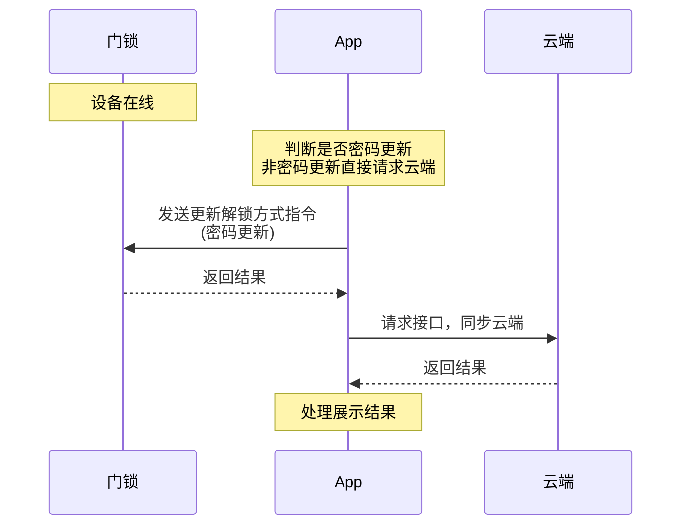

**接口说明**

`OpModeRequest` 入参数据模型参考添加解锁方式

``` java
/**
* 更新解锁方式
*
* @param opModeUpdateRequest 入参
* @param callback            回调
*/
void modifyUnlockOpModeForMember(OpModeRequest opModeUpdateRequest, IThingResultCallback<Boolean> callback);
/**
* PRO 更新解锁方式
*
* @param opModeUpdateRequest 入参
* @param callback            回调
*/
void modifyProUnlockOpModeForMember(OpModeRequest opModeUpdateRequest, IThingResultCallback<Boolean> callback);
```

**示例代码**

``` java
NotifyInfoBean notifyInfoBean = new NotifyInfoBean();
notifyInfoBean.setAppSend(true);
OpModeRequest request = new OpModeRequest();
request.setUserType();//用户类型
request.setUserId();//用户ID
request.setLockUserId();//用户的锁编号
request.setUnlockName();//解锁方式名称
request.setUnlockAttr(0);//是否特殊
request.setPassword();//密码类型解锁方式需要输入
request.setOpModeId();//云端锁ID
request.setUnlockId();//解锁方式编号
//老版本
thingLockDevice.modifyUnlockOpModeForMember(request, new IThingResultCallback<Boolean>() {
    @Override
    public void onSuccess(Boolean result) {
        Log.i(Constant.TAG, "modifyUnlockOpModeForMember onSuccess");
    }

    @Override
    public void onError(String code, String message) {
        Log.e(Constant.TAG, "modifyUnlockOpModeForMember onError:" + code + ", message: " + message);
    }
});
//PRO 更新
request.setNotifyInfo(notifyInfoBean);//通知方式开关设置
thingLockDevice.modifyProUnlockOpModeForMember(request, new IThingResultCallback<Boolean>() {
    @Override
    public void onSuccess(Boolean result) {
        Log.i(Constant.TAG, "modifyProUnlockOpModeForMember onSuccess");
    }

    @Override
    public void onError(String code, String message) {
        Log.e(Constant.TAG, "modifyProUnlockOpModeForMember onError:" + code + ", message: " + message);
    }
});
```


### App发起取消录入指纹解锁方式

该方法在录入指纹解锁方式中使用

**接口说明**
``` java
/**
* 取消录入指纹解锁方式
*
* @param lockUserId 成员锁id
* @param userType   成员类型
* @param callback   回调
*/
void cancelUnlockOpModeForFinger(int lockUserId, int userType, IResultCallback callback);
```

**示例代码**

取消成功后，会在添加解锁方式 `addUnlockOpModeForMember.onError` 上返回对应的code，code见附录

``` java
thingLockDevice.cancelUnlockOpModeForFinger(request.getLockUserId(), request.getUserType(), new IResultCallback() {
    @Override
    public void onError(String code, String message) {
         Log.e(Constant.TAG, "cancelUnlockOpModeForFinger onError:" + code + ", message: " + message);
    }

    @Override
    public void onSuccess() {
    }
});
```

### 查询单个解锁方式详情

适用与解锁方式详情查看或编辑使用

**接口说明**
``` java
/**
* 查询单个解锁方式详情
*
* @param opModeId 云端锁id
* @param callback 回调
*/
void getProUnlockOpModeDetail(long opModeId, IThingResultCallback<OpModeDetailBean> callback);
```

入参
|字段|类型|描述|
|---|---|---|
|opModeId|Long|云端锁ID|

<b>`OpModeDetailBean`</b> 数据模型

|字段|类型|描述|
|---|---|---|
|phase|Integer|用户状态<ul><li>0.冻结</li><li>1. 正常</li><li>5. 已失效</li><li>6. 未生效</li><li>7. 已删除</li></ul>|
|unlockAttr|Integer|解锁方式属性  1. 特殊解锁方式 0. 无|
|unlockName|String|解锁方式名称|
|userId|String|用户编号|
|opModeValue|String|解锁方式值(16进制)|
|opMode|String|解锁方式类型，对应dpId|
|unlockId|String|解锁方式编号|
|lockUserId|Integer|用户在锁具上的编号|
|opModeId|Long|解锁方式云端序号|
|userTimeSet|String|用户时效|
|userType|Integer|用户类型|
|sourceAttribute|Integer|开锁方式来源类型<ul><li>1. app录入</li><li>2. 门锁离线录入</li><li>3. 门锁超级管理员录入指纹</li></ul>|
|notifyInfo|NotifyInfoBean|通知设置，只有当解锁方式属性为1时返回（PRO版本）|

**示例代码**

``` java
thingLockDevice.getProUnlockOpModeDetail(opModeId, new IThingResultCallback<OpModeDetailBean>() {
    @Override
    public void onSuccess(OpModeDetailBean result) {
        Log.i(Constant.TAG, "getUnlockOpModeDetail: " + result);
    }

    @Override
    public void onError(String code, String message) {
        Log.e(Constant.TAG, "getUnlockOpModeDetail onError:" + code + ", message: " + message);
    }
});
```


### 设置/删除/解锁方式为特殊/挟持解锁

解锁方式添加和更新接口已经内置该功能，这里开放出来便于其他场景使用。

**接口说明**
``` java
/**
* 添加劫持标记
*
* @param dpId     dp点
* @param unlockId  解锁方式编号（dpId + 硬件锁id）
* @param callback 回调
*/
void addHijackingConfig(String dpId, String unlockId, IThingResultCallback<Boolean> callback);

/**
* 移除劫持标记
*
* @param dpId     dp点
* @param unlockId  解锁方式编号（dpId + 硬件锁id）
* @param callback 回调
*/
void removeHijackingConfig(String dpId, String unlockId, IThingResultCallback<Boolean> callback);
```

### App发起解锁方式同步

解锁方式添加接口已经内置该功能，这里开放出来便于其他场景使用。

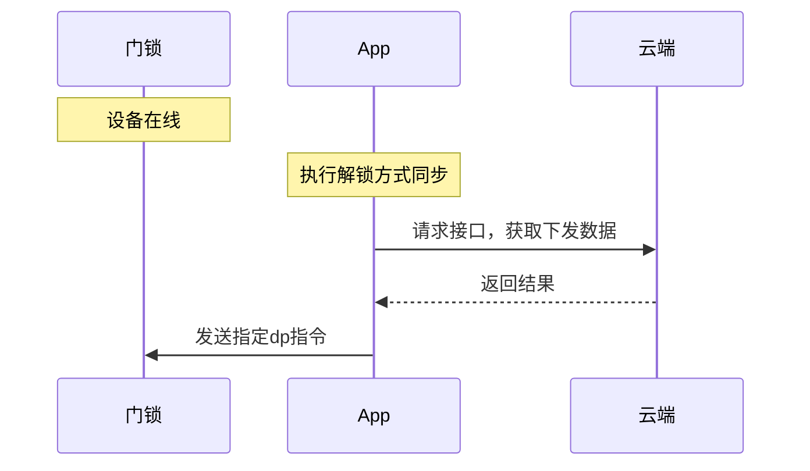

**接口说明**
``` java
/**
* 解锁方式同步
*
* @param dpIds    需要同步的解锁方式dp
* @param callback 回调
*/
void syncData(List<String> dpIds, IResultCallback callback);
```

**示例代码**
``` java
ArrayList<String> dpIds = new ArrayList<>();
dpIds.add(unlockType);
thingLockDevice.syncData(dpIds, new IResultCallback() {
    @Override
    public void onError(String code, String error) {
        Log.e(Constant.TAG, "syncData onError:" + code + ", message: " + message);
    }

    @Override
    public void onSuccess() {
        Log.i(Constant.TAG, "syncData onSuccess");
    }
});
```

### 解锁方式通知开关开启/关闭

请参考 [App发起更新解锁方式](#app发起更新解锁方式) 相关文档

## 六、密码管理

### 创建离线密码（单次、多次、清空）

**接口说明**
``` java
/**
* 获取离线密码
*
* @param pwdType    密码类型
* @param gmtStart   开始时间
* @param gmtExpired 结束时间
* @param pwdName    密码名称
* @param callback   回调
*/
void getOfflinePassword(OfflineTempPasswordType pwdType, long gmtStart, long gmtExpired,
                    String pwdName,
                    IThingResultCallback<OfflineTempPassword> callback);

/**
* PRO 获取离线密码
*
* @param pwdType    密码类型
* @param gmtStart   开始时间
* @param gmtExpired 结束时间
* @param pwdName    密码名称
* @param callback   回调
*/
void getProOfflinePassword(OfflineTempPasswordType pwdType, long gmtStart, long gmtExpired,
                        String pwdName,
                        IThingResultCallback<OfflineTempPassword> callback);
```

入参
|字段|类型|描述|
|---|---|---|
|pwdType|OfflineTempPasswordType|枚举密码类型<ul><li>0: 多次或不限次数密码</li><li>1: 一次性密码</li><li>9: 清空码</li></ul>|
|gmtStart|Long|开始时间(非多次密码传0)|
|gmtExpired|Long|结束时间(非多次密码传0)|
|pwdName|String|密码名称|


**示例代码**
``` java
//老版本
thingLockDevice.getOfflinePassword(pwdType, gmtStart, gmtExpired, name, new IThingResultCallback<OfflineTempPassword>() {
    @Override
    public void onSuccess(OfflineTempPassword result) {
        Log.i(Constant.TAG, "getOfflinePassword success :" + result);
    }

    @Override
    public void onError(String code, String message) {
        Log.e(Constant.TAG, "getOfflinePassword failed: code = " + code + "  message = " + message);
    }
});
//PRO 版本
thingLockDevice.getProOfflinePassword(pwdType, gmtStart, gmtExpired, name, new IThingResultCallback<OfflineTempPassword>() {
    @Override
    public void onSuccess(OfflineTempPassword result) {
        Log.i(Constant.TAG, "getProOfflinePassword success :" + result);
    }

    @Override
    public void onError(String errorCode, String errorMessage) {
        Log.e(Constant.TAG, "getProOfflinePassword failed: code = " + code + "  message = " + message);
    }
});
```

<b>`OfflineTempPassword`</b> 数据模型
|字段|类型|描述|
|---|---|---|
|unlockBindingId|String|解锁方式授权编号（PRO版本特有）|
|pwd|String|生成的临时密码|
|pwdId|String|密码ID|
|pwdName|String|密码名称（PRO版本特有）|
|gmtStart|Long|生效时间（秒、10位）|
|gmtExpired|Long|失效时间（秒、10位）|


### 获取单个离线密码的清空码
**接口说明**
``` java
/**
* 获取某个离线密码的清空码
*
* @param revokeRequest 入参
* @param callback      回调
*/
void getSingleRevokeOfflinePassword(OfflinePasswordRevokeRequest revokeRequest, IThingResultCallback<String> callback);
```

<b>`OfflinePasswordRevokeRequest`</b> 数据模型
|字段|类型|描述|
|---|---|---|
|passwordId|String|离线密码的编号<ul><li>PRO版本使用 `unlockBindingId`</li><li>老版本使用 `pwdId`</li></ul>|
|name|String|离线清除单个的密码名称（PRO版本特有）|

### 获取生效中的，可以被清空的离线不限次数密码
**接口说明**
``` java
/**
*
* @param callback callback
*/
void getSingleRevokePasswordList(IThingResultCallback<ArrayList<OfflineTempPassword>> callback);
```

**示例代码**
``` java
thingLockDevice.getSingleRevokePasswordList(new IThingResultCallback<ArrayList<OfflineTempPassword>>() {
    @Override
    public void onSuccess(ArrayList<OfflineTempPassword> result) {
        Log.i(Constant.TAG, "getSingleRevokePasswordList success: " + result);
    }

    @Override
    public void onError(String errorCode, String errorMessage) {
        Log.e(Constant.TAG, "getSingleRevokePasswordList failed: code = " + errorCode + "  message = " + errorMessage);
    }
});
```

**示例代码**
``` java
OfflinePasswordRevokeRequest revokeRequest = new OfflinePasswordRevokeRequest();
revokeRequest.setPasswordId();
revokeRequest.setName();//PRO版本专有
thingLockDevice.getSingleRevokeOfflinePassword(revokeRequest, new IThingResultCallback<String>() {
    @Override
    public void onSuccess(String result) {
        Log.i(Constant.TAG, "getSingleRevokeOfflinePassword success :" + result);
    }

    @Override
    public void onError(String code, String message) {
        Log.e(Constant.TAG, "getSingleRevokeOfflinePassword failed: code = " + code + "  message = " + message);
    }
});
```

### 临时在线密码重复校验
临时在线密码添加/更新已经内置该逻辑，这里开放出来可以便于其他逻辑使用。

**接口说明**
``` java
/**
* 在线密码内容有效性校验
*
* @param request  入参
* @param callback 回调
*/
void validateCustomPassword(PasswordRequest request, IThingResultCallback<Boolean> callback);
```

<b>`PasswordRequest`</b> 数据模型
|字段|类型|描述|
|---|---|---|
|id|String|密码ID，PRO版本使用 `unlockBindingId` 作为入参 |
|password|String|临时密码|
|sn|Integer|设备密码序号（创建的时候设备上报）|
|effectiveTime|Long|生效时间|
|invalidTime|Long|失效时间|
|availTime|Integer|可用次数<ul><li>0: 永久</li><li>1: 一次性（PRO版本无此选项）</li></ul>|
|name|String|密码名称|
|schedule|ScheduleBean|参数[文档](#获取门锁成员列表)上的数据模型 `ScheduleBean`|


**示例代码**
``` java
thingLockDevice.validateCustomPassword(PasswordRequest, new IThingResultCallback<Boolean>() {
    @Override
    public void onSuccess(Boolean result) {
        Log.i(Constant.TAG, "validateCustomPassword success :" + result);
    }

    @Override
    public void onError(String code, String message) {
        Log.e(Constant.TAG, "validateCustomPassword failed: code = " + code + "  message = " + message);
    }
});
```

### 创建临时在线密码（包含一次性、周期性密码）

特别说明PRO版本门锁无临时在线一次性的选择。

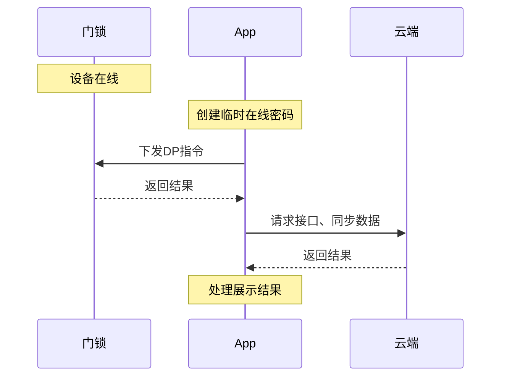

**接口说明**
`PasswordRequest` 数据模型参考上面的

``` java
/**
* 创建在线密码（包含一次性、周期性密码）
* PRO版本 自定义密码（无一次性）
*
* @param request  入参
* @param callback 回调
*/
void getCustomOnlinePassword(PasswordRequest request, IThingResultCallback<String> callback);
```

**示例代码**
``` java
thingLockDevice.getCustomOnlinePassword(PasswordRequest, new IThingResultCallback<String>() {
    @Override
    public void onSuccess(String result) {
        Log.i(Constant.TAG, "getCustomOnlinePassword success :" + result);
    }

    @Override
    public void onError(String errorCode, String errorMessage) {
        Log.e(Constant.TAG, "getCustomOnlinePassword failed: code = " + code + "  message = " + message);
    }
});
```

### 修改临时在线密码的信息/时效

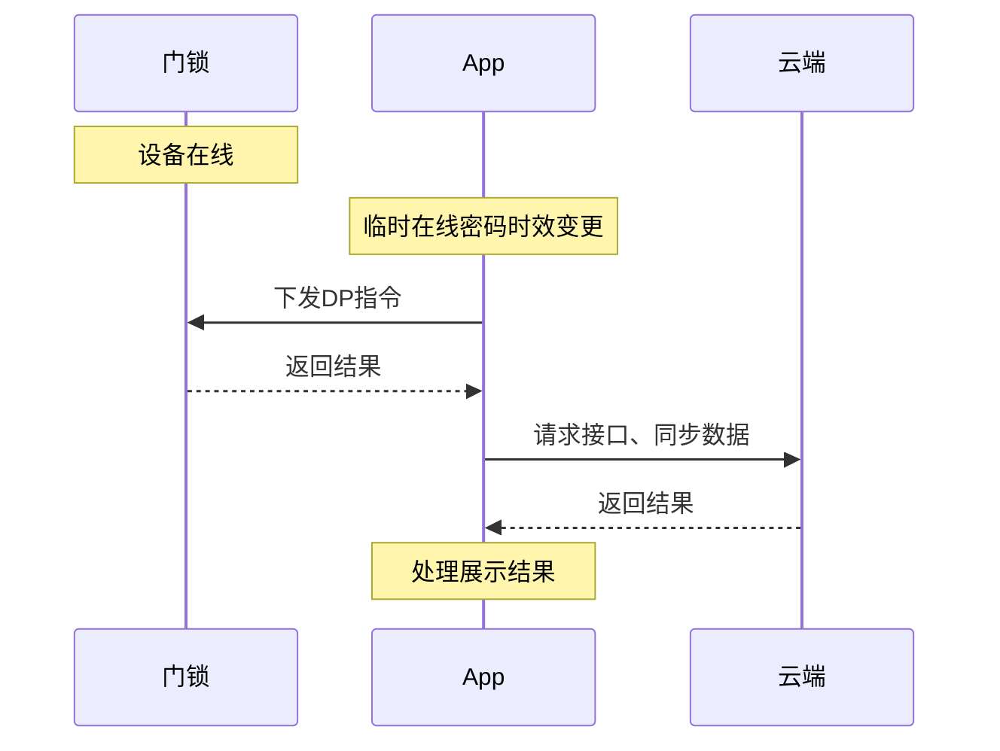

**接口说明**
``` java
/**
* 修改临时在线密码的信息/时效
*
* @param request  入参
* @param callback 监听
*/
void updateOnlinePassword(PasswordRequest request, IThingResultCallback<String> callback);
```

**示例代码**
``` java
thingLockDevice.updateOnlinePassword(passwordRequest, new IThingResultCallback<String>() {
    @Override
    public void onSuccess(String result) {
        Log.i(Constant.TAG, "updateOnlinePassword success :" + result);
    }

    @Override
    public void onError(String code, String message) {
        Log.e(Constant.TAG, "updateOnlinePassword failed: code = " + code + "  message = " + message);
    }
});
```

### 删除临时在线密码

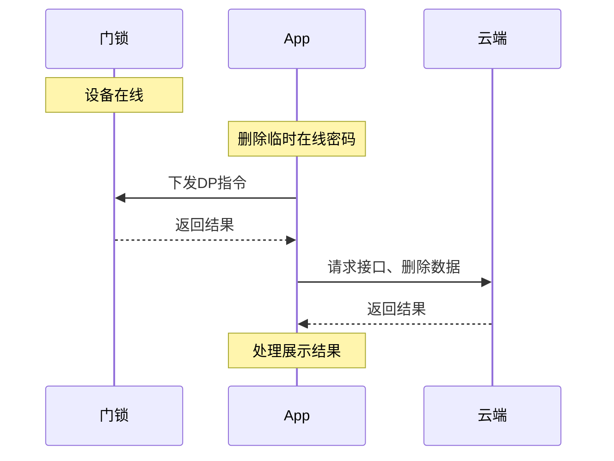

**接口说明**
``` java
/**
* 删除临时在线密码(删除记录，界面将不显示)
*
* @param deleteRequest      入参
* @param callback           回调
*/
void deleteOnlinePassword(OnlinePasswordDeleteRequest deleteRequest, IThingResultCallback<String> callback);
```

<b>`OnlinePasswordDeleteRequest`</b> 数据模型
|字段|类型|描述|
|---|---|---|
|passwordId|String|离线密码的编号，PRO版本使用 `unlockBindingId` 作为入参、老版本pwdId或id |
|sn|Integer|设备密码序号|

**示例代码**
``` java
OnlinePasswordDeleteRequest deleteRequest = new OnlinePasswordDeleteRequest();
deleteRequest.setSn(passwordItem.getSn());
deleteRequest.setPasswordId(passwordItem.getUnlockBindingId());
thingLockDevice.deleteOnlinePassword(deleteRequest, new IThingResultCallback<String>() {
    @Override
    public void onSuccess(String result) {
        Log.i(Constant.TAG, "deleteProOnlineTempPassword success: " + result);
    }

    @Override
    public void onError(String code, String message) {
        Log.e(Constant.TAG, "deleteProOnlineTempPassword failed: code = " + code + "  message = " + message);
    }
});
```

### 获取离线密码列表（老版本）
PRO版本门锁需要使用新版[列表](#获取密码列表)。

**接口说明**
``` java
/**
* 老公版 获取离线密码列表
*
* @param offlineType           密码类型：一次性、周期性、全部清空
* @param offset                起始记录数
* @param limit                 分页大小
* @param offlinePasswordStatus 密码状态：有效果、无效、使用过
* @param callback              监听
*/
void getOfflinePasswordList(OfflineTempPasswordType offlineType, int offset, int limit,
                        OfflineTempPasswordStatus offlinePasswordStatus,
                        IThingResultCallback<ArrayList<OfflineTempPasswordItem>> callback);
```

入参
|字段|类型|描述|
|---|---|---|
|offlineType|OfflineTempPasswordType|枚举类型，一次性、周期性、全部清空|
|offset|Integer|起始记录数|
|limit|Integer|分页大小|
|offlinePasswordStatus|OfflineTempPasswordStatus|枚举，有效/无效|

**示例代码**
``` java
thingLockDevice.getOfflinePasswordList(OfflineTempPasswordType.MULTIPLE, 0, 10, OfflineTempPasswordStatus.TO_BE_USED, new IThingResultCallback<ArrayList<OfflineTempPasswordItem>>() {
    @Override
    public void onSuccess(ArrayList<OfflineTempPasswordItem> result) {
        Log.i(Constant.TAG, "getOfflineTempPasswordList success: " + result);
    }

    @Override
    public void onError(String code, String message) {
        Log.e(Constant.TAG, "getOfflineTempPasswordList failed: code = " + code + "  message = " + message);
    }
});
```
<b>`OfflineTempPasswordItem`</b> 数据模型
|字段|类型|描述|
|---|---|---|
|pwdId|Integer|密码编号|
|pwdType|String|密码类型|
|pwdName|String|密码名称|
|gmtStart|Long|生效时间|
|gmtExpired|Long|过期时间|
|hasClearPwd|Boolean|是否设置过清空码<br/>--- 仅当密码类型是0(可以多次使用的密码)的时候返回|
|revokedPwdName|String|用于清除的密码名称<br/>--- 仅当密码类型是8(单个密码的清除码时返回)的时候返回 |
|status|Integer|状态<ol><li>已下发，生效中</li><li>下发成功</li><li>已失效</li></ol>|


### 获取临时在线密码列表（老版本）
PRO版本门锁需要使用新版[列表](#获取密码列表)。

**接口说明**
``` java
/**
* 老公版 在线密码列表
*
* @param availTimes 区分一次性密码或周期性密码， 0为周期性密码，1为一次性密码
* @param callback   回调
*/
void getOnlinePasswordList(int availTimes, IThingResultCallback<ArrayList<TempPasswordBeanV3>> callback);
```
入参
|字段|类型|描述|
|---|---|---|
|availTimes|Integer|0为周期性密码，1为一次性密码|

**示例代码**
``` java
thingLockDevice.getOnlinePasswordList(availTimes, new IThingResultCallback<ArrayList<TempPasswordBeanV3>>() {
    @Override
    public void onSuccess(ArrayList<TempPasswordBeanV3> result) {
        Log.i(Constant.TAG, "getOnlinePasswordList success: " + result);
    }

    @Override
    public void onError(String code, String message) {
        Log.e(Constant.TAG, "getOnlinePasswordList failed: code = " + code + "  message = " + message);
    }
});
```

<b>`TempPasswordBeanV3`</b> 数据模型
|字段|类型|描述|
|---|---|---|
|id|Integer|密码ID|
|effective|Integer|状态<ol><li>待生效</li><li>待下发</li><li>使用中</li><li>待删除</li><li>已过期</li></ol>|
|effectiveTime|Long|生效时间|
|invalidTime|Long|失效时间|
|availTime|Integer|可用次数 （0. 永久， 1. 单次）|
|name|String|密码名称|
|sn|Integer|密码在硬件编号|
|scheduleDetails|ScheduleBean|周重复失效，参考数据模型 `ScheduleBean`|


### 获取密码列表

**接口说明**

``` java
/**
* PRO 密码列表
* 授权类型
* 手机开门：LOCK_BLUE_PASSWORD
* 离线密码：LOCK_OFFLINE_TEMP_PWD
* 在线密码：LOCK_TEMP_PWD
*
* @param authTypes 授权类型
* @param callback  回调
*/
void getProPasswordList(List<ProPasswordListTypeEnum> authTypes, IThingResultCallback<ArrayList<ProTempPasswordItem>> callback);
```

入参
|字段|类型|描述|
|---|---|---|
|authTypes|List|枚举 `ProPasswordListTypeEnum`<ul><li>手机开门：LOCK_BLUE_PASSWORD</li><li>离线密码：LOCK_OFFLINE_TEMP_PWD</li><li>在线密码：LOCK_TEMP_PWD</li></ul>|

**示例代码**
``` java
List<ProPasswordListTypeEnum> authTypes = new ArrayList<>();
authTypes.add(ProPasswordListTypeEnum.LOCK_BLUE_PASSWORD);
authTypes.add(ProPasswordListTypeEnum.LOCK_OFFLINE_TEMP_PWD);
authTypes.add(ProPasswordListTypeEnum.LOCK_TEMP_PWD);
thingLockDevice.getProPasswordList(authTypes, new IThingResultCallback<ArrayList<ProTempPasswordItem>>() {
    @Override
    public void onSuccess(ArrayList<ProTempPasswordItem> result) {
        Log.i(Constant.TAG, "getProPasswordList success: " + result);
    }

    @Override
    public void onError(String errorCode, String errorMessage) {
        Log.e(Constant.TAG, "getProPasswordList failed: code = " + errorCode + "  message = " + errorMessage);
    }
});
```

<b>`ProTempPasswordItem`</b> 数据模型
|字段|类型|描述|
|---|---|---|
|unlockBindingId|Long|密码序列号|
|effectiveTime|Long|生效时间|
|invalidTime|Long|失效时间|
|name|String|名称|
|userName|String|关联用户名称（蓝牙开门分享一定存在，其他不一定）|
|scheduleDetails|List|周详情，参考: `ScheduleBean`|
|opModeType|Integer|解锁方式类型<ol><li>带时效的临时密码</li><li>普通永久密码</li><li>离线临时密码</li><li>虚拟钥匙</li><li>指纹</li><li>门卡</li><li>手机蓝牙开门方式授权</li></ol>|
|opModeSubType|Integer|见下 `解锁方式类型` 表格|
|sn|Integer|硬件端编号|
|lockUserId|Integer|用户锁id|
|account|String|用户联系方式|
|countryCode|String|国区号|
|timeSetType|Integer|时效类型<ul><li>10. 永久</li><li>20. 起止</li><li>30. 循环</li></ul>|
|opModeInfo|OPModeInfo|解锁方式独有的信息|

`opModeSubType` 解锁方式类型
|类型|描述|
|---|---|
|离线临时密码|0. 可以多次使用<br/>1. 单次使用<br/>8. 清空单个<br/>9. 清空全部|
|在线临时密码|0. 时效密码<br/>1. 只能使用一次的密码|
|手机蓝牙开门方式授权|0. 时效内可以多次使用<br/>1. 单次使用|

<b>`OPModeInfo`</b> 数据模型
|字段|类型|描述|
|---|---|---|
|hasClearPwd|Boolean|是否设置清空码(离线密码必有)|
|revokedPwdName|String|清空码名称|
|revokedPwdEffectiveTime|String|清空码有效时间|
|revokedPwdInvalidTime|String|清空码失效时间|


### 创建动态密码

**接口说明**

``` java
/**
* 获取动态密码
*
* @param callback 回调
*/
void getLockDynamicPassword(IThingResultCallback<DynamicPasswordBean> callback);
```
<b>`DynamicPasswordBean`</b> 数据模型

|字段|类型|描述|
|---|---|---|
|dynamicPassword|String|动态明文密码|

**示例代码**
``` java
thingLockDevice.getLockDynamicPassword(new IThingResultCallback<DynamicPasswordBean>() {
    @Override
    public void onSuccess(DynamicPasswordBean result) {
        Log.i(Constant.TAG, "getLockDynamicPassword onSuccess");
    }

    @Override
    public void onError(String code, String message) {
        Log.e(Constant.TAG, "getLockDynamicPassword onError:" + code + ", message: " + message);
    }
});
```

### 获取密码进制类型
通过面板云能力接口获取配置，云端返回的密码需要进行进制转换。
进制：digitalBase，首位是否隐藏0：isHideZero  这两个是配合使用的。

|配置字段名|说明|默认值|
|---|---|---|
|isHideZero|是否要隐藏 `0` <br> - true 表示从 `1` 开始<br> - false 从 `0` 开始|不配置默认为 `false`, 表示从 `0` 开始|
|digitalBase|密码支持的进制|不配置默认为 `10`

**接口说明**
``` java
/**
* 获取密码进制类型
*
* @param callback 回调
*/
void getLockDeviceConfig(IThingResultCallback<String> callback);
```

**示例代码**
``` java
thingLockDevice.getLockDeviceConfig(new IThingResultCallback<String>() {
    @Override
    public void onSuccess(String result) {
        Log.i(Constant.TAG, "getLockDeviceConfig success :" + result);
    }

    @Override
    public void onError(String errorCode, String errorMessage) {
        Log.e(Constant.TAG, "getLockDeviceConfig failed: code = " + errorCode + "  message = " + errorMessage);
    }
});
```

## 七、设置

### 远程开门开关查询

**接口说明**
``` java
/**
* 查询是否开启远程开门开关
*
* @param callback 回调
*/
void fetchRemoteUnlockType(IThingResultCallback<Boolean> callback);
```

**示例代码**
``` java
thingLockDevice.fetchRemoteUnlockType(new IThingResultCallback<Boolean>() {
    @Override
    public void onSuccess(Boolean result) {
        Log.i(Constant.TAG, "get remote unlock available success:" + result);
    }

    @Override
    public void onError(String code, String message) {
        Log.e(Constant.TAG, "get remote unlock available failed: code = " + code + "  message = " + message);
    }
});
```

### 远程开门开关设置
**接口说明**
``` java
/**
* 远程开门开关设置
*
* @param isOpen   开关配置
* @param callback 回调
*/
void setRemoteUnlockType(boolean isOpen, IResultCallback callback);
```

**示例代码**
``` java
thingLockDevice.setRemoteUnlockType(isOpen, new IResultCallback() {
    @Override
    public void onError(String code, String error) {
        Log.e(Constant.TAG, "setRemoteUnlockType failed: code = " + code + "  message = " + error);
    }

    @Override
    public void onSuccess() {
        Log.i(Constant.TAG, "setRemoteUnlockType success");
    }
});
```

### 谷歌语音密码开关查询
**接口说明**
``` java
/**
* google语音密码开启查询
*
* @param callback 回调
*/
void fetchRemoteVoiceUnlock(IThingResultCallback<Boolean> callback);
```

**示例代码**
``` java
thingLockDevice.fetchRemoteVoiceUnlock(new IThingResultCallback<Boolean>() {
    @Override
    public void onSuccess(Boolean result) {
        Log.i(Constant.TAG, "fetchRemoteVoiceUnlock success:" + result);
    }

    @Override
    public void onError(String code, String message) {
        Log.e(Constant.TAG, "fetchRemoteVoiceUnlock failed: code = " + code + "  message = " + message);
    }
});
```
### 谷歌语音密码设置
**接口说明**
``` java
/**
* 设置或取消谷歌语音密码
*
* @param isOpen   开关设置
* @param password 语音密码
* @param callback 回调
*/
void setRemoteVoiceUnlock(boolean isOpen, String password, IThingResultCallback<Boolean> callback);
```

**示例代码**
``` java
thingLockDevice.setRemoteVoiceUnlock(isOpen, password, new IThingResultCallback<Boolean>() {
    @Override
    public void onSuccess(Boolean result) {
        Log.i(Constant.TAG, "setRemoteVoiceUnlock success:" + result);
    }

    @Override
    public void onError(String code, String error) {
        Log.e(Constant.TAG, "setRemoteVoiceUnlock failed: code = " + code + "  message = " + error);
    }
});
```
### 门锁设置dp下发（示例：延时落锁开关和时延）

使用[设备控制](https://developer.tuya.com/cn/docs/app-development/andoird_device_control?id=Kaixh4pfm8f0y)相关方法

该示例为开启延时落锁，并设置了10秒的时延

**示例代码**
``` java
String automaticLock_dpId = LockUtil.convertCode2Id(deviceId, "automatic_lock");
String autoLockTime_dpId = LockUtil.convertCode2Id(deviceId, "auto_lock_time");
Map<String, Object> data = new HashMap<>();
dpMap.put(automaticLock_dpId, true);
dpMap.put(autoLockTime_dpId, 10);
IThingDevice iThingDevice = ThingHomeSdk.newDeviceInstance(mDevId);
iThingDevice.publishDps(dpMap, new IResultCallback() {
    @Override
    public void onError(String code, String error) {

    }

    @Override
    public void onSuccess() {

    }
});
```

## 八、数据同步

### 同步门锁随机数/配件/记录

<font color=#ff0000>重要：</font> App启动后，设备在线的时候执行一次。用于同步离线密码时间、门锁解锁随机数、获取门锁记录等。若未执行将无法解锁。

**接口说明**
``` java
void publishSyncBatchData();
```

**示例代码**
``` java
thingLockDevice.publishSyncBatchData();
```

### 获取同步数据内容

该方法是获取 `publishSyncBatchData` 调用方法的云端数据内容，并未与设备交互。

**接口说明**
``` java
void getSyncBatchData(IThingResultCallback<SyncBatchBean> callback);
```

**示例代码**
``` java
thingLockDevice.getSyncBatchData(new IThingResultCallback<SyncBatchBean>() {
    @Override
    public void onSuccess(SyncBatchBean result) {

    }

    @Override
    public void onError(String code, String message) {
        Log.e(Constant.TAG, "getSyncBatchData failed: code = " + code + "  message = " + message);
    }
});
```

### 解锁方式同步

解锁方式添加已内置该逻辑。

**接口说明**
``` java
/**
* 解锁方式同步
*
* @param dpIds    需要同步的解锁方式dp
* @param callback 回调
*/
void syncData(List<String> dpIds, IResultCallback callback);
```

**示例代码**
``` java
ArrayList<String> dpIds = new ArrayList<>();
dpIds.add(dpId);
thingLockDevice.syncData(dpIds, new IResultCallback() {
    @Override
    public void onError(String code, String error) {

    }

    @Override
    public void onSuccess() {

    }
});
```


## 九、附录

### 关锁记录类型
对返回的操作记录 `DataBean.unlockNameRosettaKey` 解析

|类型|说明|
|---|---|
|HISTORY_LOCK_UNDEFINED|未定义的关锁类型|
|HISTORY_LOCK_VOICE_REMOTE|远程语音开门|
|HISTORY_LOCK_APP_REMOTE|远程手机开门|
|HISTORY_LOCK_AUTO|自动落锁关锁|
|HISTORY_LOCK_LOCAL_MANUAL|本地手动落锁|
|HISTORY_LOCK_FITTINGS|配件关锁|
|HISTORY_LOCK_APP|app长按关锁|
|HISTORY_LOCK_GEO_FENCE|地理围栏关锁|

### 操作记录，数据格式定义
对返回的操作记录 `DataBean.data` 根据不同类型解析不同数据

|功能|数据定义|
|---|---|
|设备绑定|`[操作人名称，门锁名称]`|
|临时密码|`[临时密码名称， 生效时间， 失效时间，周期设置（支持多组-公版只有一组）[是否全天有效，生效分钟， 失效分钟，工作日, 时区]]`|
|用户时效<br>（支持多组）|`["被修改时效的人",是否永久，生效时间， 失效时间， 周期设置（支持多组-公版只有一组）[是否全天有效，生效分钟， 失效分钟，时区]]`<br>如果非永久，则不包含|
|解锁方式新增或移除|`[被添加人的用户编号，被添加人的用户名称， 硬件解锁方式名称, 类型-门卡(标准dp)]`|
|通信模组插拔事件|`[模组类型: 1为 ble+ nb 模组]`|
|离线密码获取|`[离线密码名称,生效时间,失效时间,离线密码类型]]`<br>离线密码类型：<ul><li>0. 多次密码</li><li>1. 单次密码</li><li>8. 清除单个</li><li>9. 清空所有已使用的</li></ul>|
|离线密码名称修改|`[原始名称，修改后的名称， 密码类型]`|
|解锁记录|`"1"` 解锁方式ID|

### 日志类型定义
对新版的日志返回类型定义
|类型|说明|
|---|---|
|dev_bind|设备绑定|
|member_schedule_update|成员时效修改|
|unlock_add|开锁方式增加|
|unlock_del|开锁方式删除|
|temp_pwd_create|临时密码增加|
|temp_pwd_del|临时密码删除|
|temp_pwd_meta_update|临时密码时效修改|
|temp_pwd_name_update|临时密码名称修改|
|offline_pwd_achieve|多次离线密码获取|
|offline_pwd_clear_achieve|清空所有离线密码获取|
|offline_pwd_clear_single_achieve|清空单个离线密码获取|
|offline_pwd_name_update|离线临时密码名称更新|
|unlock_ble|按键/蓝牙解锁|
|unlock_password|普通密码解锁|
|unlock_temporary|临时密码解锁|
|unlock_dynamic|动态密码解锁|
|unlock_offline_pd|离线密码解锁|
|unlock_offline_clear|离线密码清空所有上报|
|unlock_offline_clear_single|离线密码清空单个上报|
|unlock_fingerprint|指纹解锁|
|unlock_card|门卡解锁|
|unlock_key|机械钥匙解锁|
|unlock_face|人脸开锁|
|unlock_eye|虹膜解锁|
|unlock_hand|掌纹解锁|
|unlock_finger_vein|指静脉解锁|
|unlock_double|组合开锁(不带开门人)|
|unlock_double_kit|组合开锁(带开门人)|
|alarm_lock|告警|
|hijack|劫持|
|lock_record|关锁记录|
|unlock_record_check|配件记录|
|unlock_phone_remote|手机远程开门记录|
|unlock_app|旧版手机开门记录|
|unlock_voice_remote|音箱开门记录|
|door_opened|门被打开|
|open_inside|门从内侧打开|
|timer_opened|定时器开已执行|
|timer_closed|定时器关已执行|
|dev_communication_module_add|门锁插入或拔出模组|

### 门锁本地dp设置操作 标准dp
|类型|说明|
|---|---|
|arming_switch|离家布防|
|unlock_switch|多重验证|
|automatic_lock|自动落锁|
|auto_lock_time|落锁延迟时间|
|verify_lock_switch|上锁校验开关|
|do_not_disturb|勿扰模式|
|special_control|特殊控制|
|special_function|特殊功能|
|beep_volume|导航音量|

## 十、错误码
遵循SDK基础错误码 [查看](https://developer.tuya.com/cn/docs/app-development/errorcode?id=Ka6o3bubtl735)

|错误码|说明|
|---|---|
|10203|设备不在线|
|10204|执行超时|
|13001|密码校验不通过|
|13002|数据校验失败|
|13003|数据不存在|
|13004|DP不存在|
|13005|指纹解锁方式指纹不完整|
|13006|设备上报添加开锁方式录入失败|
|13007|设备上报添加开锁方式 userId 不存在|
|13008|解锁方式增删改-门锁响应失败|
|13009|临时在线密码更新-设备上报失败|
|13010|临时在线密码删除-设备上报失败|
|13011|临时在线密码创建-设备上报失败|
|13012|临时在线密码创建-硬件ID分配完|
|130013|用户取消指纹录入|
